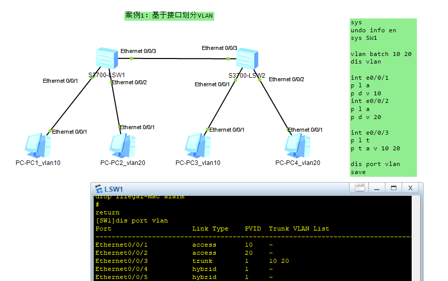

# VLAN 原理与配置实验文档

## 一、实验目的

- 掌握 **VLAN 的基本概念与作用**。
- 学会在 **华为交换机**上创建 VLAN、配置 Access 口和 Trunk 口。
- 验证不同 VLAN 之间的二层隔离。

------

## 二、实验拓扑

- 两台交换机：S3700-LSW1、S3700-LSW2
- 四台主机：PC1、PC2、PC3、PC4
- 连接方式：
  - PC1、PC3 属于 VLAN 10
  - PC2、PC4 属于 VLAN 20
  - 交换机之间的接口为 **Trunk**，允许 VLAN 10、20 通过，不允许 VLAN 1 通过。

拓扑图



------

## 三、实验步骤

### 1. 基本配置

```
sysname SW1              // 设置设备名，便于识别
undo info-center enable   // 关闭日志输出，避免干扰实验
```

### 2. 创建 VLAN

```
vlan batch 10 20          // 一次性创建 VLAN 10 和 VLAN 20
display vlan              // 查看 VLAN 是否创建成功
```

### 3. 配置接口 VLAN 归属

#### SW1：

```
int e0/0/1
 port link-type access    // 设置为 Access 接口
 port default vlan 10     // 接口归属 VLAN 10，接 PC1

int e0/0/2
 port link-type access
 port default vlan 20     // 接口归属 VLAN 20，接 PC2

int e0/0/3
 port link-type trunk
 port trunk allow-pass vlan 10 20   // Trunk 口，允许 VLAN 10 和 20 通过
 undo port trunk allow-pass vlan 1   // 禁止 VLAN 1 通过
```

#### SW2：

```
int e0/0/1
 port link-type access
 port default vlan 10     // 接 PC3，归属 VLAN 10

int e0/0/2
 port link-type access
 port default vlan 20     // 接 PC4，归属 VLAN 20

int e0/0/3
 port link-type trunk
 port trunk allow-pass vlan 10 20   // Trunk 口，连接 SW1
 undo port trunk allow-pass vlan 1   // 禁止 VLAN 1 通过
```

### 4. 保存配置(<>用户视图下)

```
save
```

------

## 四、验证

1. 给 PC1 与 PC3 配置同网段 IP（如 `192.168.10.1/24`、`192.168.10.2/24`），应能 **互通**。
2. 给 PC2 与 PC4 配置同网段 IP（如 `192.168.20.1/24`、`192.168.20.2/24`），应能 **互通**。
3. PC1 与 PC2、PC3 与 PC4 应该 **不通**（不同 VLAN 被隔离）。

------

## 五、实验总结

- **Access 口**：接口只属于一个 VLAN，用于接入终端设备。
- **Trunk 口**：可传多个 VLAN 的数据帧，用于交换机之间互联。
- VLAN 实现了二层逻辑隔离，即使主机物理上接在同一台交换机上，也能通过 VLAN 分开管理。

