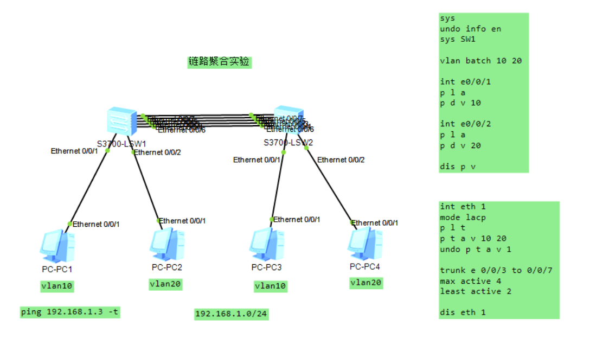
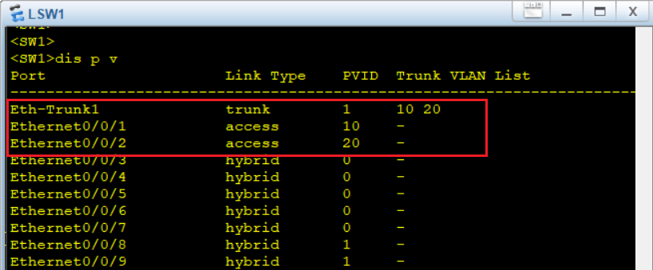
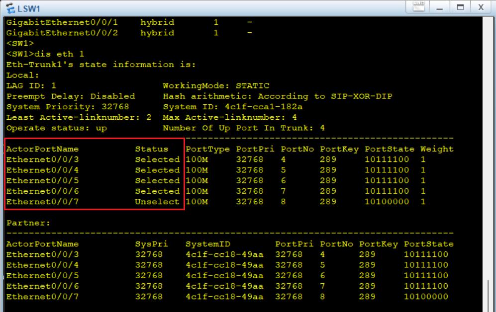

# 链路聚合（LACP）实验文档

## 一、实验目的

- 理解 **以太网链路聚合（Eth-Trunk/LACP）** 的作用与工作原理（带宽叠加、冗余、负载分担）。
- 掌握在 **华为 S3700** 交换机上创建 **Eth-Trunk**、加入成员口、配置 **Trunk 允许 VLAN** 的方法。
- 验证 LACP 选举与成员口 `Selected/Unselected` 状态变化及 **聚合链路上承载多 VLAN** 的转发能力。

------

## 二、实验拓扑

- 设备：
  - 交换机：`S3700-LSW1`、`S3700-LSW2`
  - 主机：`PC1、PC2、PC3、PC4`
- 接入与 VLAN 规划：
  - `PC1、PC3` 接入 **VLAN 10**
  - `PC2、PC4` 接入 **VLAN 20**
- 交换机间链路：
  - 使用 **5 条以太网物理链路** 聚合为 `Eth-Trunk1`（LACP 模式）
  - Trunk 口允许 **VLAN 10、20** 通过（可“undo vlan 1”）
- 建议测试地址（示例）：
  - VLAN10：`PC1=192.168.1.1/24`，`PC3=192.168.1.3/24`
  - VLAN20：`PC2=192.168.1.2/24`，`PC4=192.168.1.4/24`

> 目的：在**二层**环境下，验证同 VLAN 跨交换机互通、不同 VLAN 二层隔离；同时观察 LACP 成员口状态与主备数量策略的影响。

拓扑图示例：



------

## 三、实验步骤

### 1）基础配置（两台交换机均做）

```
sysname SW1                          // SW2 上改成 SW2
undo info-center enable              // 关闭台显日志，便于观察
vlan batch 10 20                     // 预创建业务 VLAN
```

### 2）接入口划分 VLAN（仅示例，按实际接线修改）

**SW1：**

```
interface Ethernet0/0/1
 port link-type access
 port default vlan 10                // 接 PC1

interface Ethernet0/0/2
 port link-type access
 port default vlan 20                // 接 PC2
```

**SW2：**

```
interface Ethernet0/0/1
 port link-type access
 port default vlan 10                // 接 PC3

interface Ethernet0/0/2
 port link-type access
 port default vlan 20                // 接 PC4
```

### 3）创建 Eth-Trunk，并配置为 Trunk 口（两台交换机）

```
interface Eth-Trunk1
 mode lacp                           // 选择 LACP（动态聚合）
 port link-type trunk
 port trunk allow-pass vlan 10 20
 undo port trunk allow-pass vlan 1   // 视需要禁止 VLAN1
```

> 说明：`Eth-Trunk1` 是聚合后的**逻辑口**，VLAN 透传等二层属性应当**配置在逻辑口**上，不要在成员物理口上配置 Trunk/Access 属性。

```
display port vlan            		// 确认接入口 VLAN 归属
```



### 4）把物理口加入聚合组（两台交换机）

> 假设使用 `E0/0/3 ~ E0/0/7 四个端口：

```
interface Eth-Trunk 1
  trunkport Ethernet 0/0/3 to 0/0/7
quit
```

> 注意：加入聚合**前**，这些端口上不应残留与聚合冲突的配置（例如 `port link-type ...`、限速、端口安全等）。若已配置，请先在物理口上执行 `undo` 清理为默认。

### 5）控制活动链路数量与抢占策略（两台交换机）

```
interface Eth-Trunk1
 max active-linknumber 4             // 允许最多4条活跃链路
 least active-linknumber 2   		// 预留2条为非活跃，主链路断开时再补位
```

> 与拓扑图示“max active 4 / least active 2”一致。实际可按需求调整（如全部激活则不需预留）。

```
display Eth-Trunk1         			// 看成员口 Selected/Unselected
```



### 5）持续业务验证（**新增：PC 一直 ping**）

- VLAN10：在 **PC1** 上持续 ping **PC3**

  `ping 192.168.1.3 -t`

### 6）链路“故障”注入与恢复（**新增：批量/单口 shutdown 演示**）

> 在 **SW1 或 SW2** 上操作均可，两端配置一致时现象等价。

**单口逐个切换 + 观察备用顶替（推荐）**

1. 先记录当前 **Selected/Unselected**：
    `display eth-trunk 1`

2. 对 **一条 Selected 成员口** 执行

   ```
   interface Ethernet 0/0/3
    shutdown
   ```

   立即再看
    `display eth-trunk 1`
    现象：原 **Unselected** 成员应被选为 **Selected** 顶上；PC 的持续 ping **仅瞬断 1~2 个包**或无感恢复。

3. 恢复被关口并观察回切

   ```
   interface Ethernet 0/0/3
    undo shutdown
   ```

   再次
    `display eth-trunk 1`

> 如发现成员长时间处于 Unselected，可尝试在 `Eth-Trunk1` 做 `shutdown / undo shutdown` 触发重协商；或检查成员物理口是否残留与聚合冲突的配置。

### 7）保存配置（<>用户视图下）

```
save
```

------

## 四、验证点与预期现象

1. **同 VLAN 互通**：`PC1↔PC3`、`PC2↔PC4` 互 ping 通；不同 VLAN 不通（纯二层场景）。
2. **链路冗余**：关闭一条 **Selected** 成员，**Unselected** 自动补位；持续 ping 至多数情况下仅短暂抖动。
3. **带宽聚合**（选做）：多流量源下观察 `display traffic interface Eth-Trunk1` 的吞吐变化与哈希分担。

------

## 五、常见错误与排障

- **把 Trunk/VLAN 配在物理口** → 统一移到 `Eth-Trunk1`；成员口清默认后再加入。
- **两端配置不一致**（LACP 模式、速率/双工、成员数不匹配）→ 对齐后再看 `display lacp neighbor`。
- **策略导致“怎么看都是 Unselected”** → 临时提高 `max active-linknumber` 或取消 `preempt least active-linknumber` 验证。
- **改动 Eth-Trunk L2 属性后全体 Unselected** → `shutdown/undo shutdown` 触发重协商或重选。

------

## 六、实验结果与总结

- 已完成 `Eth-Trunk1`（LACP）聚合，并允许 `VLAN 10/20` 透传。
- 按“持续 ping + 单口/批量 shutdown”验证了 **冗余顶替** 与 **业务稳定性**；截图覆盖 `display eth-trunk 1 / display port vlan / display lacp neighbor` 等关键证据点。
- 关键经验：**先配好 Eth-Trunk 逻辑口属性，再加成员**；需要观察“Selected 切换”时，适度保留**备用口**更直观。

------

## 七、附录：配置清单（示例）

**SW1（SW2 同理，主机口与主机侧互换）**

```
sysname SW1
undo info-center enable
vlan batch 10 20

# 接入口
int e0/0/1
 port link-type access
 port default vlan 10
int e0/0/2
 port link-type access
 port default vlan 20

# 聚合口（逻辑）
int Eth-Trunk1
 mode lacp
 port link-type trunk
 port trunk allow-pass vlan 10 20
 undo port trunk allow-pass vlan 1
 max active-linknumber 4
 least active-linknumber 1

# 加入成员
int Eth-Trunk 1
  trunkport Ethernet 0/0/3 to 0/0/7
quit
```