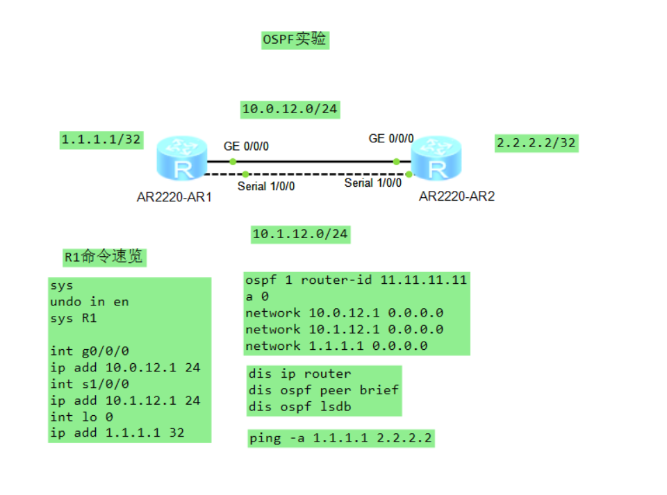
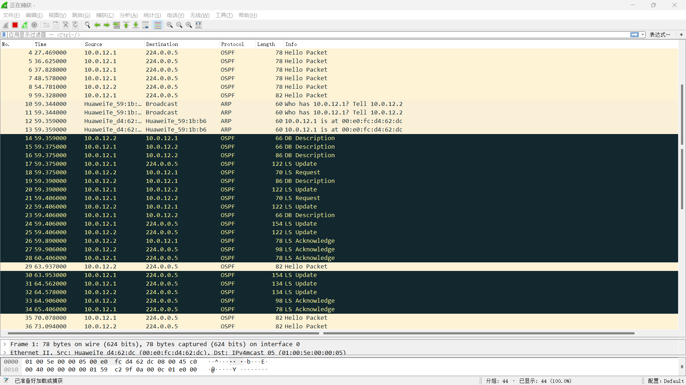
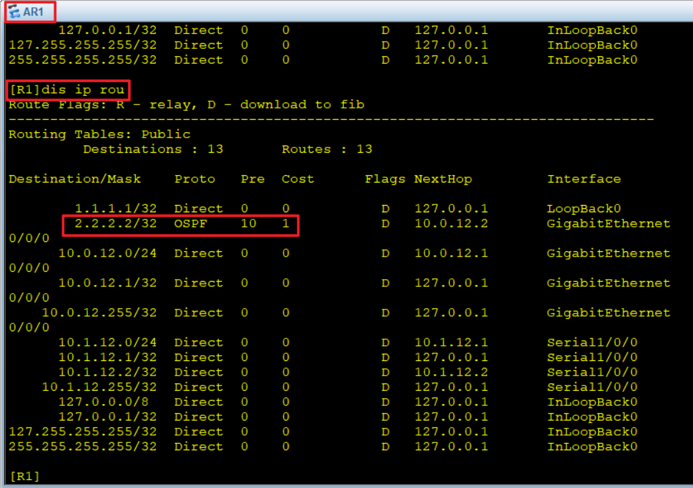
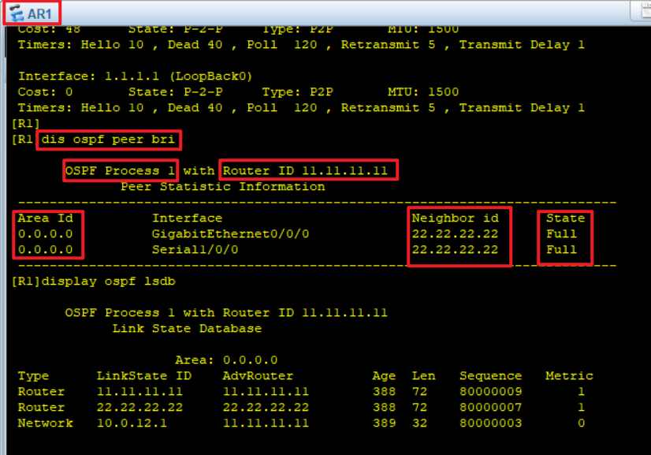
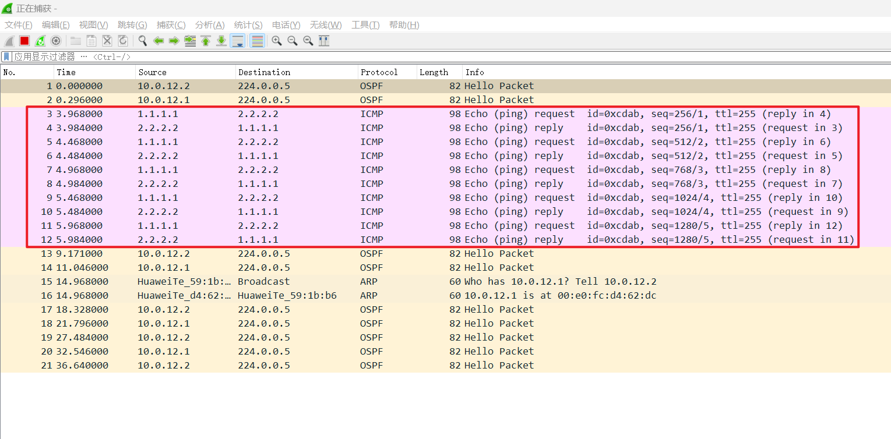
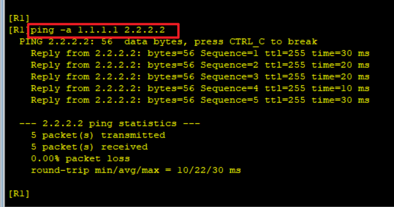

# OSPF 路由协议实验文档

## 一、实验目的

- 掌握 **OSPF 的基本概念与工作原理**。
- 学会在 **华为路由器**上配置 OSPF 路由协议。
- 验证 OSPF 邻居关系建立和路由信息交换。
- 分析 OSPF 报文类型和 LSDB 结构。

------

## 二、实验拓扑

- 两台路由器：R1、R2
- 网络连接：
  - 千兆以太网接口：G0/0/0 连接 10.0.12.0/24 网段
  - 串行接口：S1/0/0 连接 10.1.12.0/24 网段
  - 回环接口：R1 的 Loopback0 为 1.1.1.1/32，R2 的 Loopback0 为 2.2.2.2/32

拓扑图



IP地址分配：

| 设备 | 接口 | IP地址 | 子网掩码 |
|------|------|--------|----------|
| R1   | G0/0/0 | 10.0.12.1 | 24 |
| R1   | S1/0/0 | 10.1.12.1 | 24 |
| R1   | Loopback0 | 1.1.1.1 | 32 |
| R2   | G0/0/0 | 10.0.12.2 | 24 |
| R2   | S1/0/0 | 10.1.12.2 | 24 |
| R2   | Loopback0 | 2.2.2.2 | 32 |

------

## 三、实验步骤

### 1. 基本配置

#### R1 配置：

```
system-view
undo info-center enable
sysname R1

interface GigabitEthernet0/0/0
 ip address 10.0.12.1 24

interface Serial1/0/0
 ip address 10.1.12.1 24

interface Loopback0
 ip address 1.1.1.1 32
```

#### R2 配置：

```
system-view
undo info-center enable
sysname R2

interface GigabitEthernet0/0/0
 ip address 10.0.12.2 24

interface Serial1/0/0
 ip address 10.1.12.2 24

interface Loopback0
 ip address 2.2.2.2 32
```

### 2. OSPF 抓包准备

在开始配置 OSPF 之前，**此时对 R1 的 G0/0/0 接口开启抓包**，以观察完整的 OSPF 邻居建立和路由信息交换过程。

抓包设置：
- 抓包接口：R1 的 G0/0/0 接口
- 过滤条件：`ospf`
- 预期抓到的 OSPF 报文类型：
  - Hello 报文：邻居发现和维护
  - DD 报文：数据库描述
  - LSR 报文：链路状态请求
  - LSU 报文：链路状态更新
  - LSAck 报文：链路状态确认

### 3. OSPF 配置

#### R1 OSPF 配置：

```
ospf 1 router-id 11.11.11.11
 area 0
  network 10.0.12.1 0.0.0.0
  network 10.1.12.1 0.0.0.0
  network 1.1.1.1 0.0.0.0
```

#### R2 OSPF 配置：

```
ospf 1 router-id 22.22.22.22
 area 0
  network 10.0.12.2 0.0.0.0
  network 10.1.12.2 0.0.0.0
  network 2.2.2.2 0.0.0.0
```

### 4. OSPF 抓包结果分析

完成 OSPF 配置后，停止抓包并分析结果。应能看到以下 OSPF 报文类型：



**预期抓包结果：**
- **Hello 报文**：用于发现和维护邻居关系，每10秒发送一次
- **DD 报文**：数据库描述报文，用于协商主从关系和交换LSDB摘要
- **LSR 报文**：链路状态请求报文，请求具体的LSA信息
- **LSU 报文**：链路状态更新报文，包含完整的LSA信息
- **LSAck 报文**：链路状态确认报文，确认收到的LSA

### 5. 验证 OSPF 配置

回到 CLI 界面，验证 OSPF 配置结果：

```
display ip routing-table
display ospf peer brief
display ospf lsdb
```





### 6. 连通性测试

```
ping -a 1.1.1.1 2.2.2.2
```





### 7. 保存配置(用户视图下)

```
save
```

**注意事项**：如果需要重新配置 OSPF router-id，系统会提示需要重启 OSPF 进程，执行以下命令，并且输入y确认。

```
reset ospf process
```

------

## 四、验证

1. 查看 OSPF 邻居状态，应显示邻居关系已建立（Full 状态）。
2. 查看路由表，应包含 OSPF 学习到的路由条目。
3. 查看 OSPF LSDB，应包含各类 LSA 信息。
4. 在 R1 的 G0/0/0 接口抓包，应能看到 OSPF 报文：
   - Hello 报文：用于邻居发现和维护
   - DD 报文：数据库描述报文
   - LSR 报文：链路状态请求报文
   - LSU 报文：链路状态更新报文
   - LSAck 报文：链路状态确认报文
5. 从 R1 的 Loopback0 接口能够 ping 通 R2 的 Loopback0 接口。

------

## 五、实验总结

- **OSPF 工作原理**：通过 Hello 报文建立邻居关系，交换链路状态信息，构建 SPF 树，计算最优路由。
- **Router-ID 作用**：唯一标识 OSPF 路由器，用于选举 DR/BDR 和构建 LSA。
- **Area 0**：骨干区域，所有其他区域必须与骨干区域相连。
- **OSPF 报文类型**：理解 OSPF 协议的 5 种报文类型及其作用。
- **LSDB**：链路状态数据库，存储区域内所有路由器的链路状态信息。