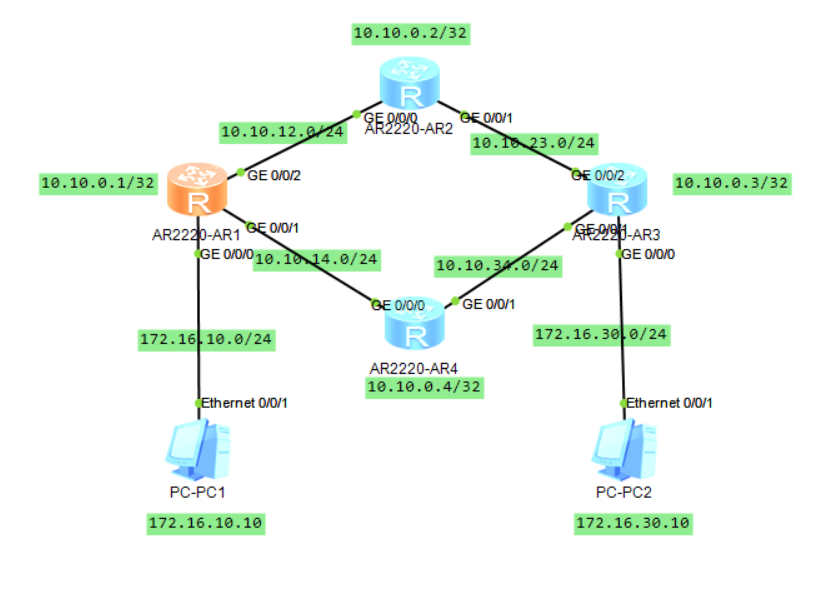

# OSPF 第三次实验文档

## 一、实验目的

- 掌握 **OSPF 单区域的基本配置**。
- 学会通过 **OSPF 开销值进行路径选择**。
- 配置 **OSPF 默认路由发布**。
- 实现 **OSPF 认证**，增强网络安全性。

------

## 二、实验拓扑

- 四台路由器：R1、R2、R3、R4
- 两台主机：PC1、PC2
- 连接方式：
  - R1 连接 PC1 和 R2、R4
  - R2 连接 R1 和 R3
  - R3 连接 R2、R4 和 PC2
  - R4 连接 R1 和 R3
  - 所有路由器参与 OSPF Area 0

拓扑图结构：



三、实验步骤

### 1. 基础 IP 配置

#### R1 配置：
```
sys
sys R1
int g0/0/0
 ip add 172.16.10.1 24    # 连接 PC1
int g0/0/1
 ip add 10.10.14.1 24     # 连接 R4
int g0/0/2
 ip add 10.10.12.1 24     # 连接 R2
int lo 0
 ip add 10.10.0.1 32      # Loopback 接口
q
dis ip int b               # 验证接口配置
```

#### R2 配置：
```
sys
sys R2
int g0/0/0
 ip add 10.10.12.2 24     # 连接 R1
int g0/0/1
 ip add 10.10.23.2 24     # 连接 R3
int lo 0
 ip add 10.10.0.2 32      # Loopback 接口
q
dis ip int b               # 验证接口配置
```

#### R3 配置：
```
sys
sys R3
int g0/0/0
 ip add 172.16.30.3 24    # 连接 PC2
int g0/0/1
 ip add 10.10.34.3 24     # 连接 R4
int g0/0/2
 ip add 10.10.23.3 24     # 连接 R2
int lo 0
 ip add 10.10.0.3 32      # Loopback 接口
q
dis ip int b               # 验证接口配置
```

#### R4 配置：
```
sys
sys R4
int g0/0/0
 ip add 10.10.14.4 24     # 连接 R1
int g0/0/1
 ip add 10.10.34.4 24     # 连接 R3
int lo 0
 ip add 10.10.0.4 32      # Loopback 接口
q
dis ip int b               # 验证接口配置
```

#### PC 配置：
```
-- PC1 --
IP地址：172.16.10.10
掩码：255.255.255.0
网关：172.16.10.1

-- PC2 --
IP地址：172.16.30.10
掩码：255.255.255.0
网关：172.16.30.3
```

### 2. 配置任务1：建立单区域OSPF

#### R1 OSPF 配置：
```
ospf 1 router-id 1.1.1.1
 area 0
  network 172.16.10.0 0.0.0.255    # 宣告 PC1 网段
  network 10.10.14.0 0.0.0.255     # 宣告 R1-R4 网段
  network 10.10.12.0 0.0.0.255     # 宣告 R1-R2 网段
  network 10.10.0.1 0.0.0.0        # 宣告 Loopback 接口
```

#### R2 OSPF 配置：
```
ospf 1 router-id 2.2.2.2
 area 0
  network 10.10.12.0 0.0.0.255     # 宣告 R1-R2 网段
  network 10.10.23.0 0.0.0.255     # 宣告 R2-R3 网段
  network 10.10.0.2 0.0.0.0        # 宣告 Loopback 接口
```

#### R3 OSPF 配置：
```
ospf 3 router-id 3.3.3.3
 area 0
  network 172.16.30.0 0.0.0.255    # 宣告 PC2 网段
  network 10.10.34.0 0.0.0.255     # 宣告 R3-R4 网段
  network 10.10.23.0 0.0.0.255     # 宣告 R2-R3 网段
  network 10.10.0.3 0.0.0.0        # 宣告 Loopback 接口
```

#### 验证 OSPF 邻居关系：
```
# 在 R1、R2、R3 上分别执行
display ip routing-table protocol ospf    # 查看 OSPF 路由表
display ospf peer brief                  # 查看 OSPF 邻居状态
```

#### 连通性测试：
```
# 在 PC1 上执行
ping 172.16.30.10        # 此时应该可以 ping 通 PC2
```

#### R4 OSPF 配置：
```
ospf 1 router-id 4.4.4.4
 area 0
  network 10.10.14.0 0.0.0.255     # 宣告 R1-R4 网段
  network 10.10.34.0 0.0.0.255     # 宣告 R3-R4 网段
  network 10.10.0.4 0.0.0.0        # 宣告 Loopback 接口
```

### 3. 配置任务2：通过开销进行选路

*(根据实验要求，修改接口的 OSPF 开销值以影响路径选择)*

### 4. 配置任务3：通过 OSPF 发布默认路由

*(在适当的路由器上配置默认路由并通过 OSPF 发布)*

### 5. 配置任务4：配置 OSPF 认证

*(配置 OSPF 接口认证以增强安全性)*

### 6. 常用验证命令

```
display ip interface brief                    # 查看接口 IP 配置
display ip routing-table protocol ospf        # 查看 OSPF 路由表
display ospf interface g0/0/0                # 查看 OSPF 接口状态
display this                                  # 查看当前配置
display ospf peer brief                      # 查看 OSPF 邻居状态
```

### 7. 保存配置

```
save
```

------

## 四、验证要点

1. **OSPF 邻居建立**：通过 `display ospf peer brief` 确认所有路由器邻居关系正常（状态为 Full）
2. **路由表学习**：通过 `display ip routing-table protocol ospf` 确认 OSPF 路由正确学习
3. **全网连通性**：PC1 应该能够 ping 通 PC2
4. **路径选择**：通过调整开销值验证路径是否按预期选择
5. **默认路由发布**：验证默认路由是否正确发布和学习
6. **认证功能**：验证 OSPF 认证是否正常工作

------

## 五、实验总结

- **OSPF Router ID**：每个 OSPF 路由器需要唯一的 Router ID
- **网络宣告**：使用 `network` 命令宣告参与 OSPF 的网络，使用反掩码
- **邻居关系**：OSPF 通过 Hello 包建立和维护邻居关系
- **路由计算**：OSPF 使用 Dijkstra 算法计算最短路径树
- **区域概念**：单区域 OSPF 中所有路由器都属于 Area 0
- **Loopback 接口**：推荐使用 Loopback 接口作为 Router ID，提高稳定性

------