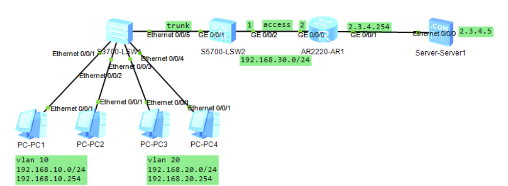
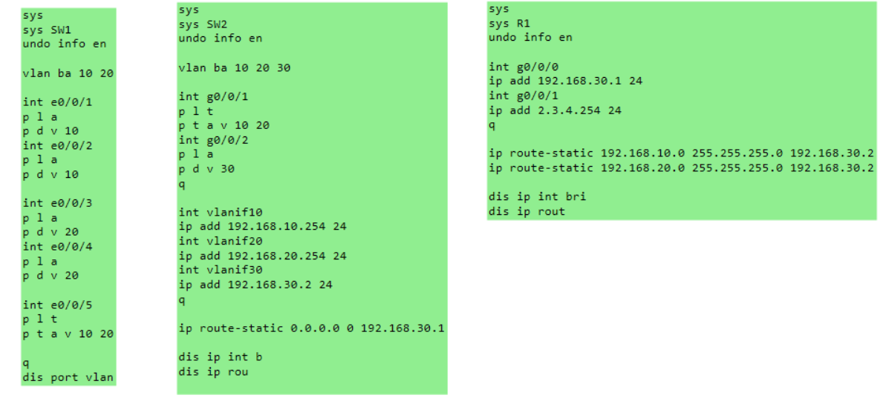

# VLAN间通信实验文档

## 一、实验目的

- 掌握 **VLAN 间通信的基本原理和实现方法**。
- 学会在 **华为交换机和路由器**上配置 VLAN 间路由。
- 理解 **三层交换机** 在 VLAN 通信中的作用。
- 掌握 **静态路由** 配置实现跨网段通信。
- 验证不同 VLAN 间的连通性和数据转发过程。

------

## 二、实验拓扑

- 三台网络设备：SW1（二层交换机）、SW2（三层交换机）、R1（路由器）
- 网络连接：
  - SW1 通过 Ethernet0/0/5 接口连接 SW2 的 GigabitEthernet0/0/1 接口
  - SW2 通过 GigabitEthernet0/0/2 接口连接 R1 的 GigabitEthernet0/0/0 接口
  - SW1 连接 PC1、PC2（VLAN 10）和 PC3、PC4（VLAN 20）
  - R1 通过 GigabitEthernet0/0/1 接口连接 Server（外网）

拓扑图



命令速览：



IP地址分配：

| 设备 | 接口 | IP地址 | 子网掩码 | 说明 |
|------|------|--------|----------|------|
| SW2 | Vlanif10 | 192.168.10.254 | 24 | VLAN10网关 |
| SW2 | Vlanif20 | 192.168.20.254 | 24 | VLAN20网关 |
| SW2 | Vlanif30 | 192.168.30.2 | 24 | VLAN30网关 |
| R1 | GigabitEthernet0/0/0 | 192.168.30.1 | 24 | 连接SW2 |
| R1 | GigabitEthernet0/0/1 | 2.3.4.254 | 24 | 外网接口 |
| PC1 | - | 192.168.10.1 | 24 | VLAN10主机 |
| PC2 | - | 192.168.10.2 | 24 | VLAN10主机 |
| PC3 | - | 192.168.20.1 | 24 | VLAN20主机 |
| PC4 | - | 192.168.20.2 | 24 | VLAN20主机 |
| Server | - | 2.3.4.5 | 24 | 外网服务器，网关2.3.4.254 |

------

## 三、实验步骤

### 1. SW1 配置（二层交换机）

#### 基本配置和VLAN创建：

```
system-view
sysname SW1
undo info-center enable

# 批量创建VLAN
vlan batch 10 20
```

#### Access接口配置：

```
# 配置Ethernet0/0/1接口（连接PC1）
interface Ethernet0/0/1
 port link-type access
 port default vlan 10

# 配置Ethernet0/0/2接口（连接PC2）
interface Ethernet0/0/2
 port link-type access
 port default vlan 10

# 配置Ethernet0/0/3接口（连接PC3）
interface Ethernet0/0/3
 port link-type access
 port default vlan 20

# 配置Ethernet0/0/4接口（连接PC4）
interface Ethernet0/0/4
 port link-type access
 port default vlan 20
```

#### Trunk接口配置：

```
# 配置Ethernet0/0/5接口（连接SW2）
interface Ethernet0/0/5
 port link-type trunk
 port trunk allow-pass vlan 10 20
```

#### 验证配置：

```
display port vlan
```

### 2. SW2 配置（三层交换机）

#### 基本配置和VLAN创建：

```
system-view
sysname SW2
undo info-center enable

# 批量创建VLAN
vlan batch 10 20 30
```

#### 接口配置：

```
# 配置GigabitEthernet0/0/1接口（连接SW1）
interface GigabitEthernet0/0/1
 port link-type trunk
 port trunk allow-pass vlan 10 20

# 配置GigabitEthernet0/0/2接口（连接R1）
interface GigabitEthernet0/0/2
 port link-type access
 port default vlan 30
```

#### VLANIF接口配置（三层接口）：

```
# 配置VLANIF10接口（VLAN10网关）
interface Vlanif10
 ip address 192.168.10.254 24

# 配置VLANIF20接口（VLAN20网关）
interface Vlanif20
 ip address 192.168.20.254 24

# 配置VLANIF30接口（连接R1）
interface Vlanif30
 ip address 192.168.30.2 24
```

#### 静态路由配置：

```
# 配置默认路由，指向R1
ip route-static 0.0.0.0 0.0.0.0 192.168.30.1
```

#### 验证配置：

```
display ip interface brief
display ip routing-table
```

### 3. R1 配置（路由器）

#### 基本配置：

```
system-view
sysname R1
undo info-center enable
```

#### 接口配置：

```
# 配置GigabitEthernet0/0/0接口（连接SW2）
interface GigabitEthernet0/0/0
 ip address 192.168.30.1 24

# 配置GigabitEthernet0/0/1接口（连接Server）
interface GigabitEthernet0/0/1
 ip address 2.3.4.254 24
```

#### 静态路由配置：

```
# 配置到VLAN10网段的路由
ip route-static 192.168.10.0 255.255.255.0 192.168.30.2

# 配置到VLAN20网段的路由
ip route-static 192.168.20.0 255.255.255.0 192.168.30.2
```

#### 验证配置：

```
display ip interface brief
display ip routing-table
```

### 4. 连通性测试

从PC1（192.168.10.1）分别ping其他设备：

```
# ping同VLAN的PC2
ping 192.168.10.2

# ping不同VLAN的PC3
ping 192.168.20.1

# ping外网Server
ping 2.3.4.5
```

### 5. ARP缓存清理和抓包分析

#### PC端操作：

```
# 查看ARP缓存表
arp -a

# 清理ARP缓存
arp -d *
```

#### 设备端操作（用户视图）：

```
# 查看ARP表
display arp

# 清理动态ARP表项
reset arp dynamic

# 再次查看ARP表
display arp
```

### 6. 保存配置

在所有设备的用户视图下执行：

```
save
```

### 7. 可选配置（关闭生成树协议）

如果需要，可以在交换机上关闭生成树协议：

```
system-view
undo stp enable
```

------

## 四、验证

1. **VLAN配置验证**：
   - 在SW1上执行 `display port vlan`，确认接口VLAN分配正确
   - 在SW2上执行 `display vlan`，确认VLAN创建和接口分配正确

2. **接口状态验证**：
   - 在所有设备上执行 `display ip interface brief`，确认接口状态为UP且IP配置正确
   - 确认VLANIF接口状态正常

3. **路由表验证**：
   - 在SW2上执行 `display ip routing-table`，确认默认路由配置正确
   - 在R1上执行 `display ip routing-table`，确认到VLAN10、20的静态路由存在

4. **连通性验证**：
   - 同VLAN主机间可以ping通（如PC1 ping PC2）
   - 不同VLAN主机间可以通过三层交换机ping通（如PC1 ping PC3）
   - VLAN10、20的主机可以通过路由器ping通外网Server（2.3.4.5）
   - ARP缓存清理后重新ping，观察ARP学习过程

5. **数据转发验证**：
   - 观察ping过程中的ARP请求和响应
   - 验证数据包经过正确的网关进行转发
   - 确认跨VLAN通信需要经过三层交换机路由

------

## 五、实验总结

- **VLAN间通信原理**：不同VLAN属于不同的广播域，需要通过三层设备进行路由才能实现通信。
- **三层交换机作用**：通过VLANIF接口实现VLAN间路由，每个VLANIF接口作为对应VLAN的网关。
- **静态路由配置**：在三层交换机上配置默认路由指向路由器，在路由器上配置回程路由指向各VLAN网段，确保跨网段通信的双向路由可达性。
- **数据转发过程**：
  - 同VLAN通信：通过二层交换机直接转发
  - 不同VLAN通信：主机→Access接口→二层交换机→Trunk接口→三层交换机→路由查找→目标VLAN接口→目标主机
- **ARP表项管理**：跨VLAN通信时，每个网段都有独立的ARP表项，需要正确配置网关。
- **网络层次设计**：合理的IP地址规划和VLAN划分是网络设计的基础，需要考虑扩展性和管理便利性。

**关键技术要点**：
1. 三层交换机的VLANIF接口配置是实现VLAN间通信的核心
2. 静态路由需要双向配置，确保数据包能够往返传输
3. Trunk链路的VLAN允许列表必须包含需要通过的VLAN
4. 网关配置的正确性直接影响跨网段通信的成功