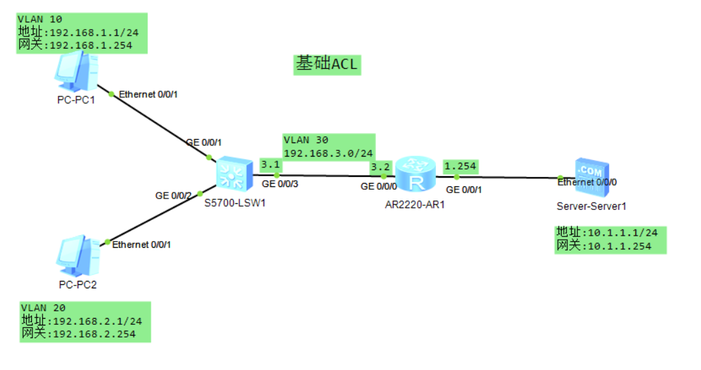
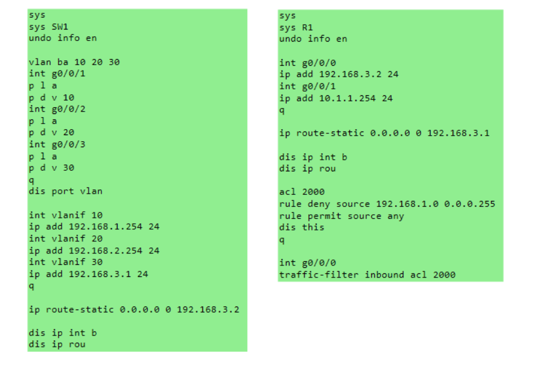

# ACL基础实验文档

## 一、实验目的

- 掌握 **访问控制列表（ACL）的基本原理和分类**。
- 学会在 **华为交换机和路由器**上配置基本ACL。
- 理解 **ACL的流量过滤机制和应用方向**。
- 掌握 **ACL规则配置和接口应用**方法。
- 验证ACL在网络访问控制中的实际效果。

------

## 二、实验拓扑

- 两台网络设备：SW1（三层交换机）、R1（路由器）
- 网络连接：
  - SW1 通过 GigabitEthernet0/0/0 接口连接 R1 的 GigabitEthernet0/0/0 接口
  - SW1 连接三个VLAN的主机：
    - VLAN 10：PC1（192.168.1.1）
    - VLAN 20：PC2（192.168.2.1）
    - VLAN 30：连接路由器的网络
  - R1 通过 GigabitEthernet0/0/1 接口连接外网Server（10.1.1.1）

拓扑图：



命令速览：



IP地址分配：

| 设备 | 接口 | IP地址 | 子网掩码 | 说明 |
|------|------|--------|----------|------|
| SW1 | Vlanif10 | 192.168.1.254 | 24 | VLAN10网关 |
| SW1 | Vlanif20 | 192.168.2.254 | 24 | VLAN20网关 |
| SW1 | Vlanif30 | 192.168.3.1 | 24 | VLAN30网关 |
| R1 | GigabitEthernet0/0/0 | 192.168.3.2 | 24 | 连接SW1 |
| R1 | GigabitEthernet0/0/1 | 10.1.1.254 | 24 | 外网接口 |
| PC1 | - | 192.168.1.1 | 24 | VLAN10主机 |
| PC2 | - | 192.168.2.1 | 24 | VLAN20主机 |
| Server | - | 10.1.1.1 | 24 | 外网服务器，网关10.1.1.254 |

------

## 三、实验步骤

### 1. SW1 配置（三层交换机）

#### 基本配置和VLAN创建：

```
system-view
sysname SW1
undo info-center enable

# 批量创建VLAN
vlan batch 10 20 30
```

#### Access接口配置：

```
# 配置GigabitEthernet0/0/1接口（连接PC1）
interface GigabitEthernet0/0/1
 port link-type access
 port default vlan 10

# 配置GigabitEthernet0/0/2接口（连接PC2）
interface GigabitEthernet0/0/2
 port link-type access
 port default vlan 20

# 配置GigabitEthernet0/0/3接口（连接路由器）
interface GigabitEthernet0/0/3
 port link-type access
 port default vlan 30
```

#### VLANIF接口配置（三层接口）：

```
# 配置VLANIF10接口（VLAN10网关）
interface Vlanif10
 ip address 192.168.1.254 24

# 配置VLANIF20接口（VLAN20网关）
interface Vlanif20
 ip address 192.168.2.254 24

# 配置VLANIF30接口（连接R1）
interface Vlanif30
 ip address 192.168.3.1 24
```

#### 静态路由配置：

```
# 配置默认路由，指向R1
ip route-static 0.0.0.0 0.0.0.0 192.168.3.2
```

#### 验证配置：

```
display port vlan
display ip interface brief
display ip routing-table
```

### 2. R1 配置（路由器）

#### 基本配置：

```
system-view
sysname R1
undo info-center enable
```

#### 接口配置：

```
# 配置GigabitEthernet0/0/0接口（连接SW1）
interface GigabitEthernet0/0/0
 ip address 192.168.3.2 24

# 配置GigabitEthernet0/0/1接口（连接Server）
interface GigabitEthernet0/0/1
 ip address 10.1.1.254 24
```

#### 静态路由配置：

```
# 配置默认路由指向SW1
ip route-static 0.0.0.0 0.0.0.0 192.168.3.1

# 或者等价写法：配置到各VLAN网段的路由
ip route-static 192.168.1.0 255.255.255.0 192.168.3.1
ip route-static 192.168.2.0 255.255.255.0 192.168.3.1
```

#### 验证配置：

```
display ip interface brief
display ip routing-table
```

### 3. 基础连通性测试

从PC1（192.168.1.1）分别ping其他设备：

```
# ping同VLAN的网关
ping 192.168.1.254

# ping不同VLAN的PC2
ping 192.168.2.1

# ping外网Server
ping 10.1.1.1
```

**预期结果**：此时全网互通，PC2、Server均可达。

### 4. ACL配置

#### 创建基本ACL：

```
# 创建基本ACL 2000
acl 2000

# 配置规则：禁止192.168.1.0/24网段访问服务器网络
rule deny source 192.168.1.0 0.0.0.255

# 配置规则：允许其他所有流量
rule permit source any

# 查看ACL配置
display this
quit
```

#### ACL应用配置：

```
# 方式一：在入方向应用ACL（在连接内网的接口）
interface GigabitEthernet0/0/0
 traffic-filter inbound acl 2000

# 方式二：在出方向应用ACL（在连接外网的接口）
interface GigabitEthernet0/0/1
 traffic-filter outbound acl 2000

# 注意：两个流量过滤取其一即可生效
```

### 5. ACL效果验证

#### 应用ACL后再次测试：

从PC1（192.168.1.1）分别ping其他设备：

```
# ping同VLAN的PC2
ping 192.168.2.1

# ping外网Server
ping 10.1.1.1
```

**预期结果**：
- PC2可达（不同VLAN但受路由器控制）
- Server不可达（被ACL规则阻止）

#### 其他测试场景：

```
# 从PC2（192.168.2.1）测试访问
ping 192.168.1.1  # 应该可达
ping 10.1.1.1     # 应该可达

# 查看ACL匹配统计
display acl 2000
```

### 6. 保存配置

在所有设备的用户视图下执行：

```
save
```

------

## 四、验证

1. **VLAN配置验证**：
   - 在SW1上执行 `display port vlan`，确认接口VLAN分配正确
   - 在SW1上执行 `display vlan`，确认VLAN创建和接口分配正确

2. **接口状态验证**：
   - 在所有设备上执行 `display ip interface brief`，确认接口状态为UP且IP配置正确
   - 确认VLANIF接口状态正常

3. **路由表验证**：
   - 在SW1上执行 `display ip routing-table`，确认默认路由配置正确
   - 在R1上执行 `display ip routing-table`，确认到各VLAN的静态路由存在

4. **ACL配置验证**：
   - 在R1上执行 `display acl 2000`，确认ACL规则配置正确
   - 检查ACL应用方向和接口是否正确

5. **连通性验证**：
   - **ACL应用前**：全网互通，所有主机可以互相访问
   - **ACL应用后**：
     - PC1无法访问外网Server（被ACL阻止）
     - PC1可以访问PC2（通过内部路由）
     - PC2可以访问所有网络（不受ACL限制）
     - ACL匹配计数增加，验证规则生效

6. **流量过滤验证**：
   - 观察ACL规则匹配次数，确认流量被正确过滤
   - 验证不同源IP地址的流量处理结果
   - 确认ACL应用方向的正确性

------

## 五、实验总结

- **ACL基本原理**：访问控制列表是基于规则的数据包过滤机制，通过匹配源IP地址、目标IP地址、协议类型、端口号等信息来决定是否允许数据包通过。

- **ACL分类和应用**：
  - **基本ACL**：只基于源IP地址进行过滤（编号2000-2999）
  - **高级ACL**：可以基于源IP、目标IP、协议、端口等多种信息过滤（编号3000-3999）
  - **应用方向**：可以在接口的入方向（inbound）或出方向（outbound）应用

- **ACL规则匹配机制**：
  - **顺序匹配**：按照规则编号从小到大依次匹配
  - **隐式拒绝**：如果没有匹配的permit规则，默认拒绝流量
  - **一旦匹配立即执行**：不继续检查后续规则

- **ACL配置要点**：
  - **规则顺序很重要**：应该将具体规则放在前面，一般规则放在后面
  - **合理使用permit any**：通常在最后添加允许其他流量的规则
  - **注意应用方向**：inbound影响进入接口的流量，outbound影响离开接口的流量

- **实际应用场景**：
  - **网络访问控制**：限制特定网段访问敏感资源
  - **安全防护**：阻止恶意IP地址访问内部网络
  - **流量管理**：控制不同用户组的网络访问权限
  - **服务隔离**：实现不同业务系统间的访问控制

**关键技术要点**：
1. ACL的匹配是自上而下的，一旦匹配立即执行相应动作
2. 每个接口的每个方向只能应用一个ACL
3. 基本ACL只能基于源IP地址过滤，适合简单的网段控制
4. 配置ACL时要注意"最小权限原则"，只允许必要的流量
5. 验证ACL效果时，要测试多种场景确保规则按预期工作