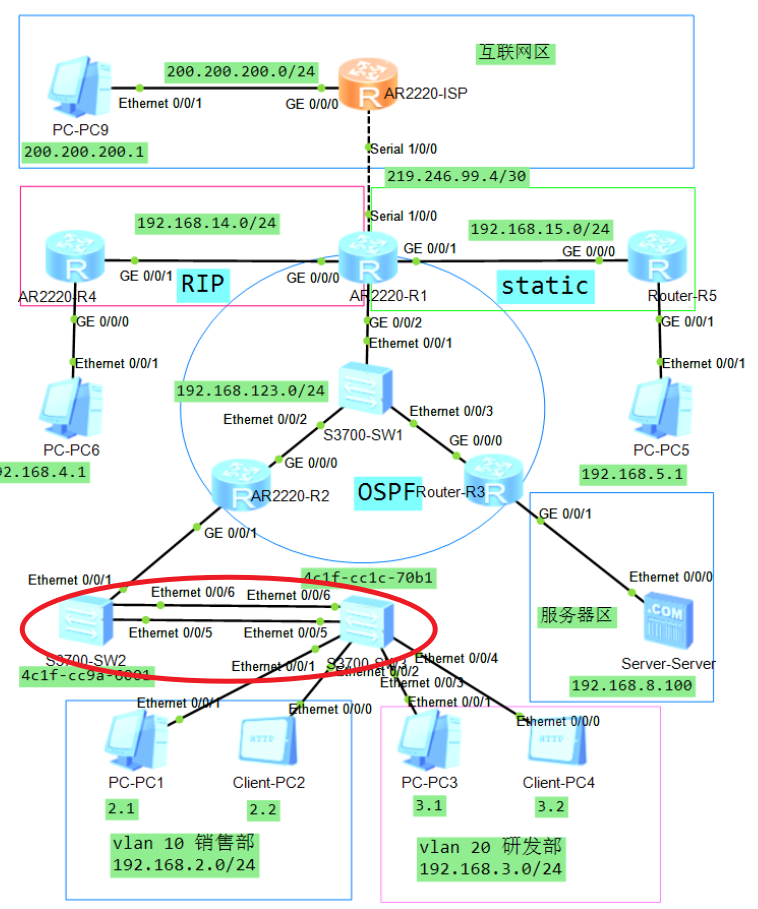

# 链路聚合速记笔记

## 📊 单臂路由 vs 链路聚合 对比

| 特性 | **单臂路由 (Router on a Stick)** | **链路聚合 (Eth-Trunk/Link Aggregation)** |
|------|----------------------------------|-------------------------------------------|
| **目的** | 实现不同VLAN之间的三层路由互通 | 增加链路带宽、提供冗余备份 |
| **工作层次** | 三层（网络层） | 二层（数据链路层） |
| **应用场景** | 路由器连接交换机，处理多VLAN间路由 | 交换机之间或交换机与服务器之间 |
| **解决的问题** | VLAN间通信隔离问题 | 单链路带宽不足、单点故障问题 |
| **关键技术** | 子接口 + 802.1Q VLAN标签 | 多物理链路捆绑为一个逻辑链路 |
| **配置位置** | 路由器接口 | 交换机之间 |

---
txt
## 🔧 在期末拓扑中配置链路聚合的位置



从拓扑图可以看到，**S3700-SW2** 和 **S3700-SW3** 之间存在**两条链路**：
- `Ethernet 0/0/5` ↔ `Ethernet 0/0/5`
- `Ethernet 0/0/6` ↔ `Ethernet 0/0/6`

这正是配置链路聚合的理想位置！当前配置中这两个接口是作为独立的Trunk接口使用（配合STP），如果考察链路聚合，会将这两个接口捆绑成一个 `Eth-Trunk`。

---

## 📝 链路聚合可能的考察形式/配置要求

### **考察形式1：手动负载均衡模式 (Manual Load-Balance)**

```
题目示例：
1. 在SW2和SW3上创建Eth-Trunk 1，配置为手动负载均衡模式
2. 将SW2和SW3的E0/0/5和E0/0/6接口加入Eth-Trunk 1
3. 配置Eth-Trunk 1为Trunk接口，允许VLAN 10、VLAN 20通过
```

**SW2配置：**
```bash
int eth-trunk 1
mode manual load-balance
trunkport eth 0/0/5 to 0/0/6
port link-type trunk
port trunk allow-pass vlan 10 20
```

**SW3配置：**
```bash
int eth-trunk 1
mode manual load-balance
trunkport eth 0/0/5 to 0/0/6
port link-type trunk
port trunk allow-pass vlan 10 20
```

---

### **考察形式2：LACP模式（更复杂，综合考察）**

```
题目示例：
1. 在SW2和SW3上创建Eth-Trunk 1，配置为LACP模式
2. 将SW2和SW3的E0/0/5和E0/0/6接口加入Eth-Trunk 1
3. 配置SW2的系统LACP优先级为1，使SW2成为主动端
4. 配置最大活动链路数为2，最小活动链路数为1
5. 配置Eth-Trunk 1为Trunk接口，允许VLAN 10、VLAN 20通过
```

**SW2配置：**
```bash
lacp priority 1                      # 系统LACP优先级，值越小优先级越高

int eth-trunk 1
mode lacp                            # LACP模式
trunkport eth 0/0/5 to 0/0/6
max act 2                            # 最大活动链路数
least act 1                          # 最小活动链路数
lacp preempt en                      # 启用LACP抢占
port link-type trunk
port trunk allow-pass vlan 10 20
```

**SW3配置：**
```bash
int eth-trunk 1
mode lacp
trunkport eth 0/0/5 to 0/0/6
port link-type trunk
port trunk allow-pass vlan 10 20
```

---

## 🎯 关键考点总结

| 考点 | 关键命令 |
|------|----------|
| **创建Eth-Trunk** | `int eth-trunk 1` |
| **模式选择** | `mode manual load-balance` 或 `mode lacp` |
| **添加成员接口** | `trunkport eth 0/0/5 to 0/0/6` |
| **LACP系统优先级** | `lacp priority 1` （全局配置） |
| **LACP接口优先级** | `int e0/0/5` → `lacp priority 1` |
| **活动链路数** | `max act 2` / `least act 2` |
| **启用抢占** | `lacp preempt en` |
| **验证命令** | `dis eth-trunk 1` |

---

## ⚠️ 注意事项

1. **与STP冲突**：如果原题已经配置了STP（当前题目中SW3的E0/0/5被配置为阻塞端口），配置链路聚合后**不需要再单独配置STP**，因为Eth-Trunk会作为一个逻辑接口参与STP计算

2. **VLAN配置**：链路聚合后，VLAN的Trunk配置要在 `Eth-Trunk 1` 接口上做，而不是物理接口上

3. **两端配置一致**：SW2和SW3的链路聚合配置（模式、成员接口）必须一致才能成功建立聚合

---

## 📋 单臂路由配置参考（对比用）

在路由器R2的G0/0/1接口上创建子接口，作为VLAN 10和VLAN 20的网关：

**R2配置：**
```bash
int g0/0/1.10
ip address 192.168.2.254 24
dot1q termination vid 10
arp broadcast enable

int g0/0/1.20
ip address 192.168.3.254 24
dot1q termination vid 20
arp broadcast enable
```

**关键命令说明：**
- `int g0/0/1.10`：创建子接口
- `dot1q termination vid 10`：关联VLAN 10的802.1Q标签
- `arp broadcast enable`：开启ARP广播（必须配置，否则无法正常通信）
